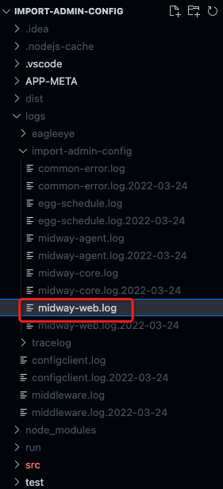

### 1、服务器日志查看，一条搞定
```
tail -1f xxx.log
```
```
tail -1f bianque-app.* | grep '/JoinActiveService/queryAlipayEmail'
```

### 2、mac查看端口号
```
lsof -i:12808
```
lsof: list open files

### 3、过滤历史日志
> 可以参看多个日志，然后通过grep过滤
[grep使用](https://juejin.cn/post/7053664079042314277)
```
cat bianque-app.* | grep '/JoinActiveService/queryAlipayEmail'
```
### 4、midway默认路径
路径：/home/admin/logs/import-admin-config
文件:midway-web.log 

### 5、本地日志
  
