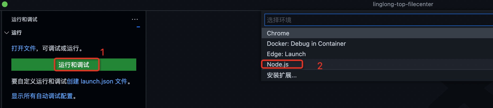
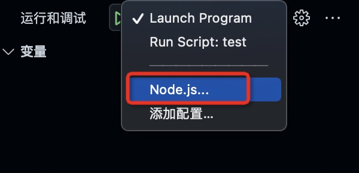
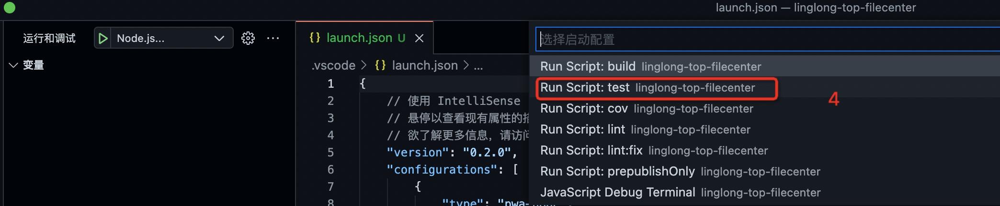

## 1、参考资料
[nodejs调试指南](https://github.com/nswbmw/node-in-debugging)  
[8分，vscode调试node，不要chrome devtools](https://github.com/nswbmw/node-in-debugging/blob/master/4.3%20Visual%20Studio%20Code.md)  

## 2、demo(成功)
在简单项目中行，在复杂项目中不行，好烦躁！！！
+ 在个人电脑上可以，工作电脑上不行
+ 原因：vscode 1.64.0 有问题，需要回退到1.63.0，真是fuck
+ 可用地址：https://code.visualstudio.com/updates/v1_63


## 3、debugger配置
```
{
    "version": "0.2.0",
    "configurations": [
        {
            "type": "pwa-node",
            "request": "launch",
            "name": "node调试demo",
            "skipFiles": [
                "<node_internals>/**"
            ],
            "program": "${workspaceFolder}/src/app.js",
            "debuggStdLib":true
        }
    ]
}
```

## 4、测试用例debugger(以linglong-top-filecenter为例)
  
  
  
