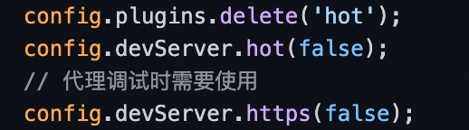
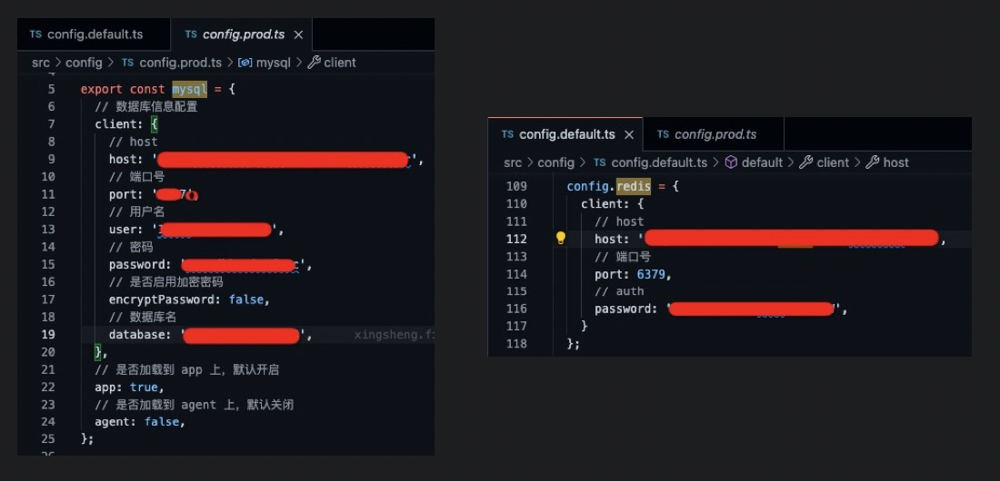
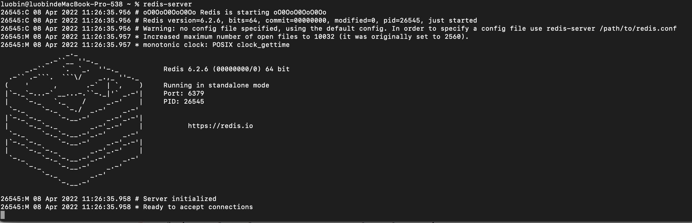
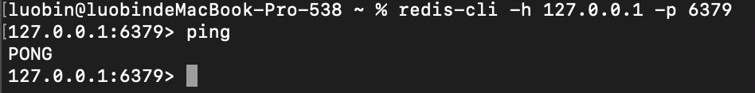
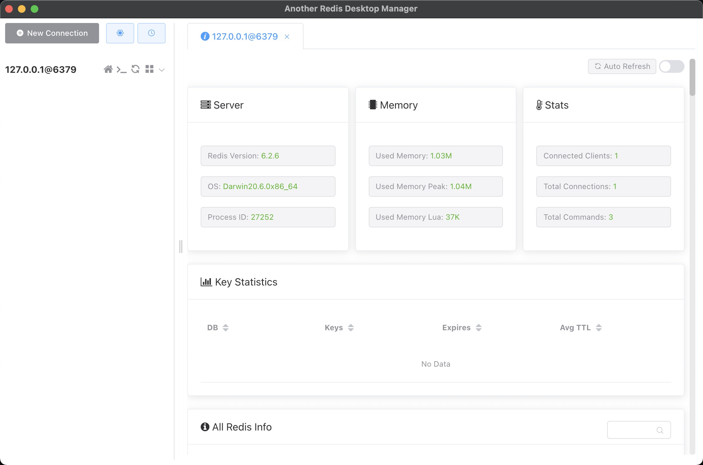
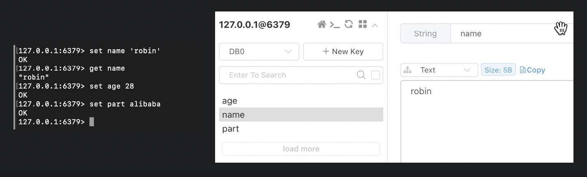
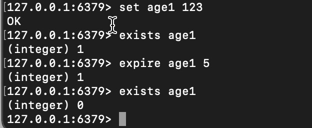

- [一、基础知识](#一基础知识)
  - [1、开发服务器可以配置https](#1开发服务器可以配置https)
  - [2、redis  vs mysql](#2redis--vs-mysql)
  - [3、ioredis资料](#3ioredis资料)
  - [4、redis安装使用](#4redis安装使用)
        - [客户端界面（AnotherRedisDesktopManager）](#客户端界面anotherredisdesktopmanager)
  - [5、redis学习](#5redis学习)
  - [6、常用命令](#6常用命令)
- [二、编辑锁实现](#二编辑锁实现)
  - [1、客户端](#1客户端)
- [附录](#附录)
  - [1、转ms的工具:ms](#1转ms的工具ms)
## 一、基础知识
### 1、开发服务器可以配置https
  

### 2、redis  vs mysql
+ redis：非关系型数据库；存储在缓冲中，读取数据快
+ mysql：关系型数据库；存储在硬盘中，读取速度慢

两者都是c/s结构，都需要一个远程服务器
> 目前mysql是所有环境配置，redis只配置一个环境

  

### 3、ioredis资料
[github](https://github.com/luin/ioredis)  
[midway redis](http://midwayjs.org/docs/extensions/redis)  

### 4、redis安装使用
[官网](https://redis.io/)  
[安装教程](https://blog.csdn.net/realize_dream/article/details/106227622)

安装指令：`brew install redis`
启动指令：`redis-server`
  
客户端链接：`redis-cli -h 127.0.0.1 -p 6379`
> 服务器自带客户端，默认ip 127.0.0.1,默认端口 6379

  

关闭指令：`redis-cli -h 127.0.0.1 -p 6379 shutdown`

###### 客户端界面（AnotherRedisDesktopManager）
[推荐](https://juejin.cn/post/6875109882006077448)   
[github](https://github.com/qishibo/AnotherRedisDesktopManager)   
  

### 5、redis学习
[redis入门](https://juejin.cn/post/6844903639765483533)  

  

### 6、常用命令
[文档](https://juejin.cn/post/6844903462279331853)  
+ setnx：设置成功返回1，失败返回0（如果已经存在则setnx会失败）

  

+ exists / expire ：是否存在/设置超期时间
  

## 二、编辑锁实现
### 1、客户端

## 附录
### 1、转ms的工具:ms
  
