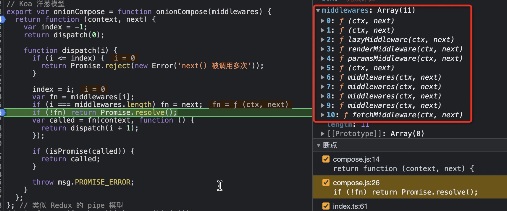

- [问题：query(params)查询后，通过getParams获取params为空](#问题queryparams查询后通过getparams获取params为空)
  - [基本原理](#基本原理)
  - [middlewares数组](#middlewares数组)
  - [断点](#断点)

## 问题：query(params)查询后，通过getParams获取params为空

### 基本原理
调用query时，执行:use-table/src/middlewares/render.ts
```js
store.paramMap.set(params);
```
调用getParams，执行:use-adapt-plugin-src/index.ts
```js
getParams: () => {
  return adaptParams(ctx.store.paramMap.get(), map);
}
```
所以关键点排查set为什么没有调用

### middlewares数组
洋葱模型核心代码:use-query-display/src/compose.ts#onionCompose
```js
export const onionCompose: IComposer['onionCompose'] = (middlewares) => (context, next) => {
  let index = -1;
  return dispatch(0);
  function dispatch(i: number) {
    if (i <= index) {
      return Promise.reject(new Error('next() 被调用多次'));
    }
    index = i;
    let fn = middlewares[i];
    if (i === middlewares.length) fn = next;
    if (!fn) return Promise.resolve();

    const called = fn(context, () => dispatch(i + 1));

    if (isPromise(called)) {
      return called;
    }
    throw msg.PROMISE_ERROR;
  }
};
```
### 断点
+ 总共11个中间件，最后一个为fetchMiddleware，执行最终的请求调用

  

+ 代码为:use-table/src/middlewares/fetch.ts
只有请求返回正确，调用了next，才会执行11个中间件的返回流程
```js
const fetchMiddleware: Middleware = (ctx, next) => {
  const { [REQUEST_SYMBOL]: request, params, [PAYLOAD_SYMBOL]: payload, state, actions } = ctx;
  const { threshold } = request;

  if (parseInt(threshold, 10) === 0) {
    actions.setState({ loading: true });
  } else {
    const loadingTimer = setTimeout(() => {
      actions.setState({ loading: true });
    }, threshold);

    ctx.meta[LOADING_TIMER] = loadingTimer;
  }

  return request
    .service(params, {
      payload,
      state,
      actions,
    })
    .then(
      (res: Obj) => {
        ctx.response = res;
        return next().then(() => Promise.resolve(ctx.response));
      },
      (err: Obj = {}) => {
        const reject = request.reject || (() => null);
        const { content = {} } = err;
        clearTimeout(ctx.meta[LOADING_TIMER]);
        actions.setState({ loading: false, dataSource: [], current: 1, total: 0 });
        reject(content.data, err);
        return Promise.reject(err);
      },
    );
};
```
+ renderMiddlleWare是第4个中间件，next前没有代码（入葱阶段不执行），next后有代码（出葱阶段执行）
   *因为返回异常，所以没有执行出葱阶段，所以没有设置store*
```js
const renderMiddleware: Middleware = (ctx, next) => {
  return next().then(() => {
    const { response = {}, params, [REQUEST_SYMBOL]: request, meta, actions, store } = ctx;

    const { data = {} } = response;
    const { current, pageSize } = data;
    // 以后端返回的为首要
    params.current = current || params.current;
    params.pageSize = pageSize || params.pageSize;

    const resolve = request.resolve || (() => ({}));
    store.paramMap.set(params);
    clearTimeout(meta[LOADING_TIMER]);

    actions.setState({
      loading: false,
      dataSource: data.dataSource || [],
      current: params.current,
      pageSize: params.pageSize,
      total: data.total || 0,
    });

    resolve(response);
    return Promise.resolve(response);
  });
};
```